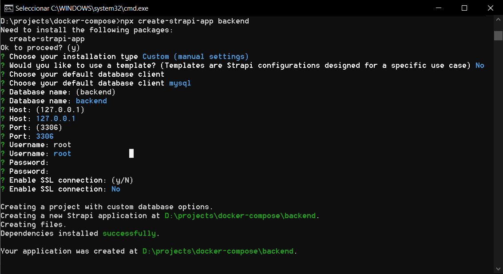
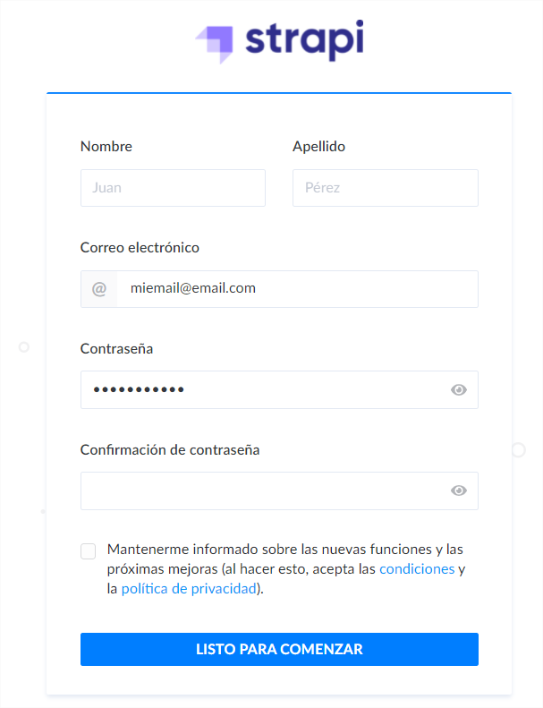
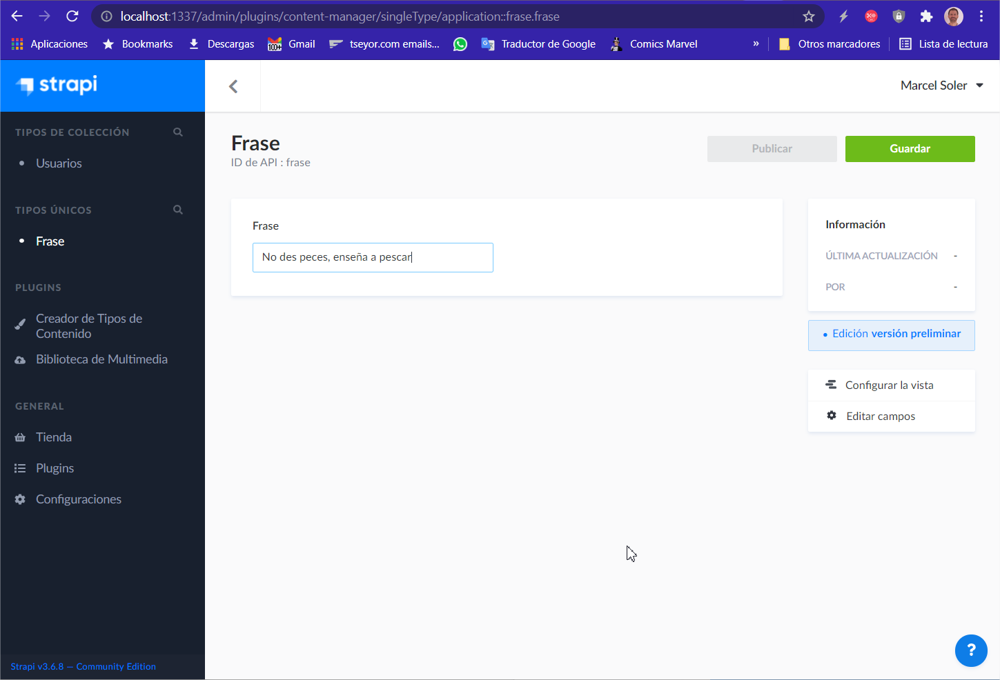
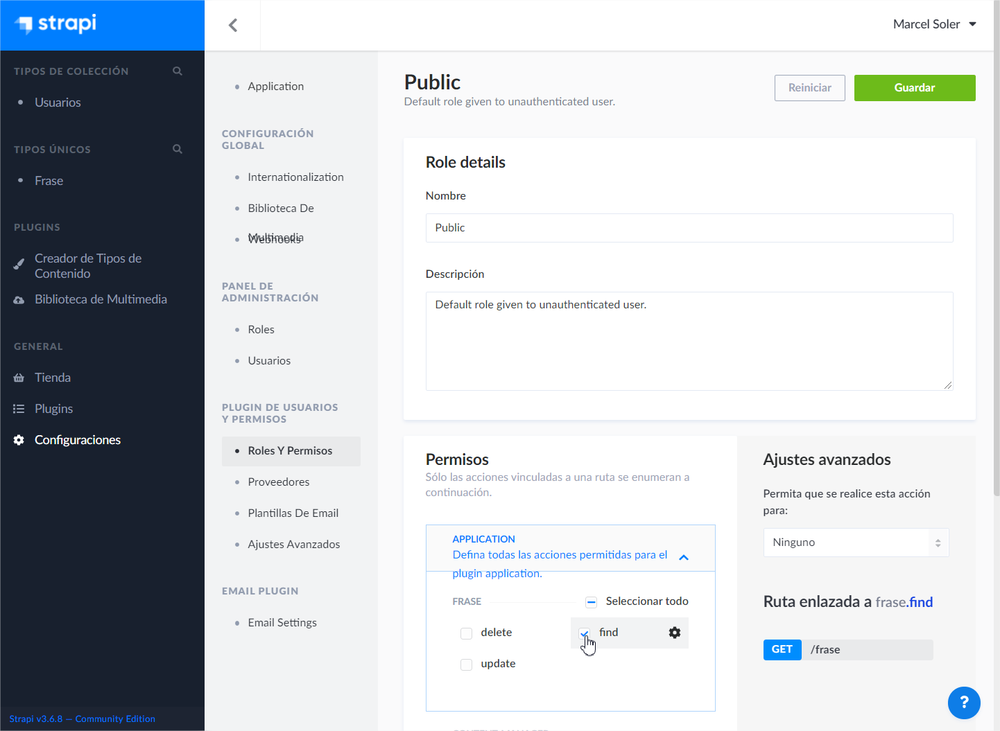
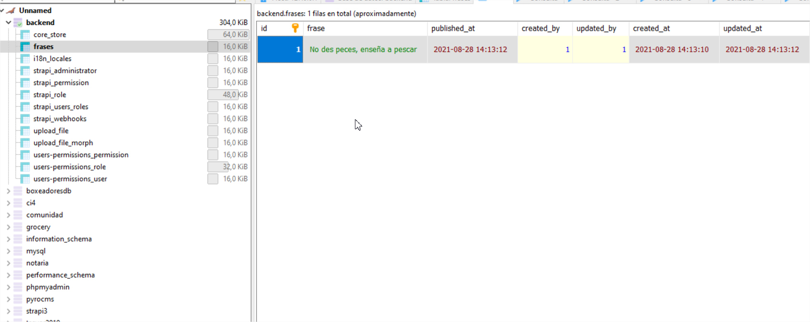
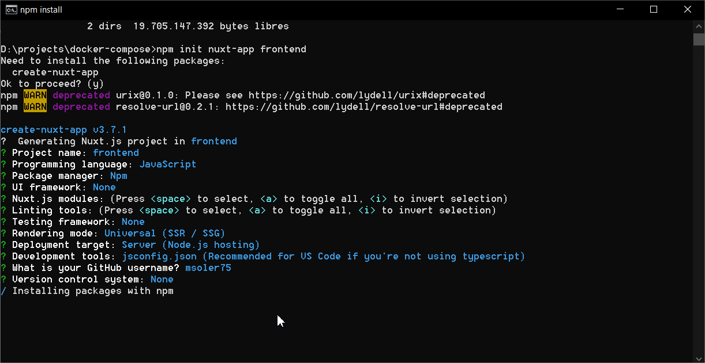
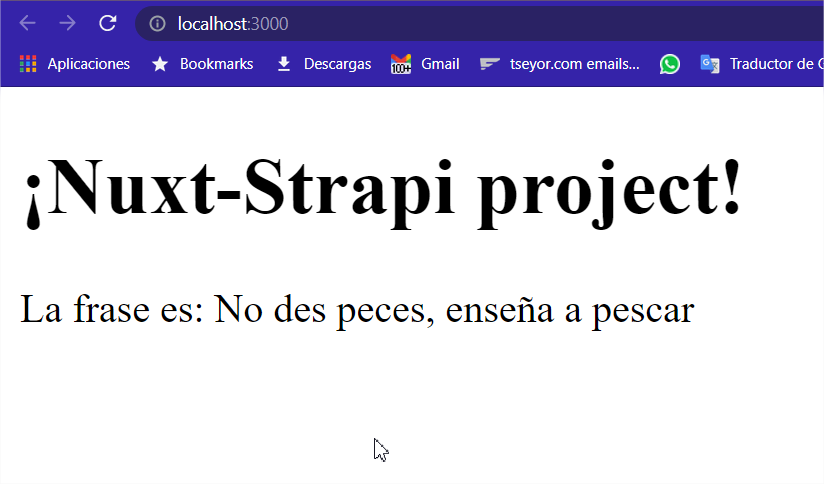
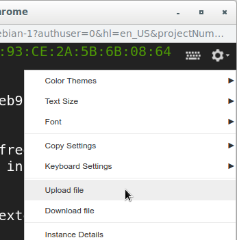

# Tutorial

## Parte 1: creación del proyecto en nuestra máquina local

Primero crearemos un entorno puramente local de nuestro proyecto hasta verlo funcionar. 

### Creación de backend on STRAPI v3

**0\) Requerimientos previos:**

- tener npm instalado
- tener node.js instalado (versión \>10, y \<14)
- disponer en nuestra máquina de un servidor de base de datos de tipo mysql.
- crearemos previamente una base de datos de nombre "backend"

**1\) Creamos el proyecto de strapi con base de datos mysql**

`> npx create-strapi-app backend`

Para este proyecto sencillo elegiremos la opción "custom" y sin ninguna
template.

Nos pedirá poner los datos de acceso a la base de datos. En nuestro
caso:

- database: mysql
- nombre de la database: backend
- usuario: root
- contraseña (ninguna)



**2\) Arrancamos la aplicación de servidor de strapi**

`> cd backend`

`> npm run develop`

**3\) Abrimos en el navegador la URL del servidor localhost:1337**

Nos aparece la página inicial para crear el usuario superadministrador

Importante: anota los datos de acceso para o el servidor quedará
inaccesible



**4\) Creamos un tipo único: Frase**

Con el Creador de Tipos de Contenido (Content Type Builder) cremos un nuevo tipo único llamado Frase.

Le añadimos un campo de texto corto, de nombre "frase".

Se reinicializará el servidor.

Si ahora no aparece el campo único Frase a la izquierda, recargamos la página y si aún no aparece, reiniciamos el servidor con npm run develop.

**5\) Editamos el tipo único Frase, y establecemos un valor en el campo "frase"**

El valor en este campo es: "No des peces. Enseña a pescar".

Y guardamos.



**6\) Damos permisos para que el usuario público pueda acceder a ese tipo**

Configuraciones → Roles y Permisos → (role) Public → Application → Frase
→ find



**7\) Si abrimos un navegador y ponemos esta url, veremos el contenido**

`http://localhost:1337/frase`

La respuesta del servidor será algo así:

`{"id":1,"frase":"No des peces, enseña a pescar","published_at":"2021-08-28T14:13:12.000Z","created_at":"2021-08-28T14:13:10.000Z","updated_at":"2021-08-28T14:13:12.000Z"}`

**8\) Todo se está guardando correctamente en la base de datos en mysql**

Si accedemos a ver el contenido de nuestra base de datos (en este caso estoy usando HeidiSQL) veremos que en realidad un tipo único es una colección (frases) con un solo elemento.



---

### Creación del frontend con NUXT v2

**1\) creamos el proyecto Nuxt**

`> npm init nuxt-app frontend`

Podéis usar las opciones de instalación que se muestran a continuación,
o las que os vengan bien.



**2\) Instalamos el módulo de strapi para nuxt**

`> cd frontend`

`> npm i @nuxtjs/strapi`

**3\) Editamos nuxt.config.js y añadimos el módulo de strapi**

nuxt.config.js:
```
  modules: ['@nuxtjs/strapi'],
  strapi: {
    url: 'http://localhost:1337'
  }
```

**4\) Editamos la página índice**

pages/index.vue:
```
<template>
  <div>
      <h1>
        ¡Nuxt-Strapi project! 
      </h1>
      <p>
        La frase es: {{frase}}
      </p>
   </div>
</template>
<script>
export default {
  async asyncData ({$strapi}) {
    const Frase = await $strapi.find('frase')
    return { frase: Frase.frase }
  }
}
</script>
```

**5\) arrancamos la app de nuxt**

`> npm run dev`

**6\) Vamos al navegador y cargamos la página localhost:3000**



Vemos que el frontend está funcionando y carga desde el servicio de strapi la frase antes almacenada.

---

## Parte 2: Creación de imágenes docker

En esta parte crearemos las dos imágenes docker para el frontend y el backend. Para luego poder correrlas en la máquina virtual de Google Cloud.

El servicio de mysql lo correremos desde una imagen mysql que ya existe en los repositorios públicos.

### Creamos una imagen DOCKER de nuestro proyecto strapi

Vamos a crear una imagen de docker con los contenidos del proyecto actual de strapi.

**0\) Requisitos:**

- Debes tener instalado docker en tu sistema.


**1\) Creamos un archivo Dockerfile en la carpeta backend**

`> cd backend`

Dockerfile:
```
FROM node:14-alpine3.14

WORKDIR /src

ADD . ./
RUN npm install 
RUN npm run build

# solo si queremos que funcione docker composer:
RUN apk add curl && curl -OL https://raw.githubusercontent.com/mrako/wait-for/master/wait-for && chmod +x wait-for

# expose 1337 on container
EXPOSE 1337

#
ENV HOST=0.0.0.0

# start the app
CMD [ "npm", "run", "start" ]
```

El script *wait-for* nos servirá si queremos utilizar docker compose. Si no, no es necesario.

**2\) Creamos el archivo *.dockerignore***

.dockerignore:
```
node_modules
npm-debug.log
Dockerfile
.dockerignore
.git
.gitignore
.env
```

**3\) Ejecutamos docker build**

La forma más sencilla es estando en la carpeta del backend y ejecutar

`> docker build . -t project_strapi`

El parámetro -t sirve para etiquetar la imagen resultante.

---

### Creamos una imagen DOCKER de nuestro frontend con nuxt


**1\) creamos un archivo Dockerfile en la carpeta frontend**

Dockerfile:
```
FROM node:14-alpine3.14

# create destination directory
RUN mkdir -p /usr/src/nuxt-app
WORKDIR /usr/src/nuxt-app

# copy the app, note .dockerignore
COPY . /usr/src/nuxt-app/
RUN npm install

# build necessary, even if no static files are needed,
# since it builds the server as well
RUN npm run build

# expose 5000 on container
EXPOSE 5000

# set app serving to permissive / assigned
ENV NUXT_HOST=0.0.0.0
# set app port
ENV NUXT_PORT=5000

# start the app
CMD [ "npm", "run", "start" ]
```

*Nota: en esta imagen usaremos el puerto 5000 en lugar del habitual 3000*

**2\) Copiamos aquí también el archivo *.dockerignore* de antes**

**3\) Ejecutamos el comando *docker build* para construir una imagen**

`> docker build . -t project_nuxt`

---

## Parte 3: Preparamos el repositorio de Google Cloud Artifacts

**0\) Requisitos previos:**

- Hemos creado un proyecto en Google Cloud de nombre *mi_proyecto*
- Hemos habilitado la facturación del proyecto
- Hemos habilitado la API de *Artifacts* en nuestro proyecto
- Hemos creado un repositorio en Google cloud artifacts de nombre *mirepo* ubicado en *europe-west2*
- Hemos instalado la aplicación de consola de Google Cloud en nuestra máquina local

**1\) Habilitamos la autorización en nuestra máquina local**

`> gcloud auth configure-docker europe-west2-docker.pkg.dev`

**2\) Etiquetamos las imagenes para que puedan ser ubicadas en el repositorio de google cloud artifacts**

`> docker tag project_strapi europe-west2-docker.pkg.dev/mi_proyecto/mirepo/project_strapi`
`> docker tag project_nuxt europe-west2-docker.pkg.dev/mi_proyecto/mirepo/project_nuxt`

**3\) pusheamos las imagenes al repositorio**

`> docker push europe-west2-docker.pkg.dev/mi_proyecto/mirepo/project_strapi`
`> docker tag project_strapi europe-west2-docker.pkg.dev/mi_proyecto/mirepo/project_nuxt`

---

## Parte 4: Creamos instancia de maquina virtual (VM) 

Para ello usaremos la imagen *Container-Optimized OS*, que está especializada en correr docker. Hay varias versiones, se puede usar la más reciente.

**1\) creamos la instancia**

Podemos consultar la documentación:
https://cloud.google.com/container-optimized-os/docs/how-to/create-configure-instance

En resumen, se puede crear desde la consola con el comando siguiente:

`> gcloud compute instances create webnodeserver --image cos-89-16108-470-16 --image-project cos-cloud --zone southamerica-east1-c --machine-type g1-small`

**2\) corremos (run) la instancia y abrimos sesión SSH**

**3\) damos permisos al sistema para acceder a nuestro repositorio privado de Artifacts**

`> docker-credential-gcr configure-docker --registries europe-west2-docker.pkg.dev`

**4\) (opcional) ahora podemos descargar imagenes de nuestro repositorio**

`> docker pull europe-west2-docker.pkg.dev/mi_proyecto/mirepo/project_strapi`

`> docker pull europe-west2-docker.pkg.dev/mi_proyecto/mirepo/project_nuxt`

**5\) Preparamos la base de datos**

Necesitaremos el archivo *database.sql* con la creación de la base de datos, las tablas y la inserción de todos los datos.

Para subir el archivo a la instancia (VM) abriremos sesión SSH y con la opción de terminal (rueda dentada) subiremos el archivo database.sql



Ver tutorial en
https://cloud.google.com/compute/docs/instances/transfer-files

---

## Parte 5: Ejecutar los servicios en contenedores Docker

**0\) Estamos dentro del terminal SSH de la instancia**

**1\) Arrancamos el servicio de mysql**

`> docker run --name servidor_mysql --net=host -e MYSQL_ROOT_PASSWORD=x9k1kz0 -d mysql:5.7`

**2\) Importamos la base de datos desde el archivo database.sql**

`> docker exec -i servidor_mysql mysql -uroot -px9k1kz0 mysql < database.sql`

**3\) Creamos un usuario con privilegios de acceso**

Primero accedemos al contenedor:

`> docker exec -it servidor_mysql mysql -uroot -px9k1kz0 mysql`

Una vez dentro de mysql, ejecutamos:

`mysql> CREATE USER 'admin'@'%' IDENTIFIED BY '123';`

`mysql> GRANT ALL PRIVILEGES ON *. * TO 'admin'@'%' WITH GRANT OPTION;`

`mysql> exit`

*Nota importante: la contraseña 123 es solo para este ejercicio, pero debería usarse otra más compleja para mayor seguridad.*

**4\) Comprobamos el puerto abierto 3306**

`> sudo netstat -tulpn | grep LISTEN`

Tenemos que ver el puerto 3306 de mysql.

**5\) Abrir firewall**

Para que el servidor mysql pueda escuchar peticiones entrantes desde el exterior debemos abrir el cortafuegos (firewall) de la instancia y crear una nueva regla.

Aprovecharemos también para abrir el puerto de strapi 1337 para poder entrar en la administración de strapi desde el exterior

Crear una regla de FireWall:

- Nombre: default-incoming-3306-1337
- Dirección del tráfico: Entrada
- Acción en caso de coincidencia: Permitir
- Destino: Etiquetas de destino especificadas: *mysql-strapi*
- Filtro de Origen: Rangos IP Origen: 0.0.0.0/0
- Protocolos y puertos: TCP: 3306,1337

Para que el firewall aplique correctamente, hemos de agregar la etiqueta de red *mysql-strapi* en la instancia. Editamos los datos de la instancia y agregamos esa etiqueta.

**6\) Ejecutamos el contenedor de strapi**

Antes hemos de saber la IP externa de nuestra instancia VM. Para ello consultamos la página
https://console.cloud.google.com/compute/instances

Una vez sabemos la IP externa, la reemplazamos en los siguientes comando en {EXTERNAL_IP}

`> docker run -d --name container_strapi -p 1337:1337 -e "DATABASE_HOST={EXTERNAL_IP}" -e "DATABASE_USERNAME=admin" -e "DATABASE_PASSWORD=123" europe-west2-docker.pkg.dev/mi_proyecto/mirepo/project_strapi`

Por ejemplo, si la IP fuera 77.35.33.67 el comando sería:

`> docker run -d --name container_strapi -p 1337:1337 -e "DATABASE_HOST=77.35.33.67" -e "DATABASE_USERNAME=admin" -e "DATABASE_PASSWORD=123" europe-west2-docker.pkg.dev/mi_proyecto/mirepo/project_strapi`


**7\) Ejecutamos el contenedor de nuxt**

`> docker run -d --name container_nuxt -p 80:5000 -e "STRAPI_URL=http://{EXTERNAL_IP}:1337" europe-west2-docker.pkg.dev/mi_proyecto/mirepo/project_nuxt`

**8\) Manejando docker**

Para ver los contenedores corriendo:

`> docker ps -a`

Para ver los contenedores (corriendo o no)

`> docker container ls`

Para parar un contenedores

`> docker container stop container_strapi`

Para borrar un contenedor

`> docker rm nombre_contenedor`

Para eliminar contenedores finalizados

`> docker container prune`

---

## Final

¡Ya podemos abrir la url con la IP externa de la instancia y veremos la página funcionando!

Siguiendo el ejemplo de IP externa de antes, cargamos esta url en nuestro navegador:

http://77.35.33.67

*Nota: no va a funcionar, es tan solo un ejemplo.*


Además, podremos acceder al servidor de mysql mediante el puerto 3306 y a la parte administrativa de strapi con el puerto 1337

MySQL: http://77.35.33.67:3306

Strapi Administración: http://77.35.33.67:1337